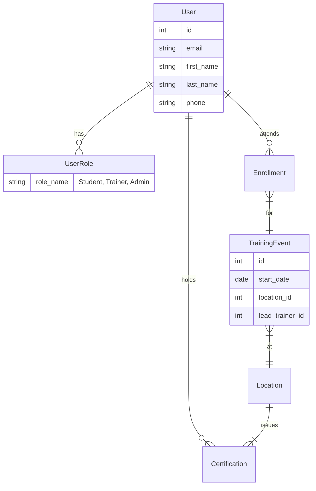

# NIDCAP Training Database: Current Architecture Analysis

## 1. Technology Stack Analysis

The current `db.nidcap.org` application is a legacy monolithic system.

### Server-Side
*   **Web Server:** Microsoft IIS 10.0
*   **Framework:** ASP.NET 4.0.30319 (WebForms)
*   **Hosting Control Panel:** Plesk (Windows)
*   **State Management:** Heavily relies on Server-Side ViewState (`__VIEWSTATE` hidden field) to maintain state across postbacks.
*   **Page Model:** Postback model (`__doPostBack`) where user interactions trigger full form submissions to the same URL.

### Client-Side
*   **Architecture:** Multi-page application (MPA) with Master Pages (evident from `cpMainContent_` control ID prefixes).
*   **JavaScript:**
    *   Standard ASP.NET WebForms scripts (`WebUIValidation.js`, `WebResource.axd`).
    *   Inline event handlers (e.g., `javascript:WebForm_DoPostBackWithOptions(...)`).
*   **Styling:** Likely server-generated styles with limited responsive design capabilities.

---

## 2. Data Structure & Schema Analysis

This schema is inferred from `Students.csv` headers and the "Edit Student" form fields (`StudentRecords_edit.aspx`).

### Entity: STUDENT (Core)
The central record for all professionals.

| Field Label | DOM Element ID | CSV Column | Data Type | Notes |
| :--- | :--- | :--- | :--- | :--- |
| **ID** | (Hidden) | `student_id` | Integer | Primary Key |
| **First Name** | `txtFirstName` | `first_name` | String | |
| **Middle Name** | `txtMiddleName` | `middle_name` | String | |
| **Last Name** | `txtLastName` | `last_name` | String | |
| **Email** | `txtEmail` | `email` | String | *Critical for auth if migrated* |
| **Trainer?** | `cbSetAsTrainer` | `trainer` (1/0) | Boolean | **Crucial logic flag**. If checked, student appears in Trainer dropdowns. |
| **Credentials** | `txtCredentials` | `credentials` | String | Free text (e.g., "RN, PhD") |
| **Work Phone** | `txtWorkPhone` | `work_phone` | String | |
| **Home Phone** | `txtHomePhone` | `home_phone` | String | |
| **Work Location**| `ddlLocation` | `location_id` | FK (Int) | Links to *Location* entity. |
| **Prof. Role** | `ddlProfessionalRole` | `professionalrole_id`| FK (Int) | Lookup: Nurse, Physician, OT, PT, etc. |
| **Spec. Prof.** | `ddlSpecificProfession`| `specificprofession_id`| FK (Int) | More granular role info. |
| **Addresses** | `txtWorkAddress1-4` | `work_address...` | String | 4 lines for Work, 2 for Home. |

### Entity: CERTIFICATION
Managed via a sub-table (GridView) on the Student page.
*   **Composite Key:** `Student` + `CertificationType` + `Date`.
*   **Relationships:**
    *   **Level:** (e.g., "NIDCAP Professional", "API B Professional").
    *   **Training Center:** The Location where training occurred.
    *   **Trainer:** The specific Trainer who signed off.

### Entity: TRAINING COURSE (Enrollment)
Historically appears to conflate the *Course Event* with the *Enrollment*.
*   **Fields:** `CourseName`, `Date`, `MasterTrainer`, `Location`.
*   **Observation:** In the current UI, these appear in a "Course History" grid. A modern schema should strictly separate the **Event** (Class) from the **Enrollment** (Student in Class).

---

## 3. Data Migration Risks
1.  **"Trainer" Flag:** This simple boolean likely controls complex permissions. In a modernization, this should be converted to a specific **Role**.
2.  **Free Text Fields:** Fields like `Credentials` are unstructured.
3.  **Address format:** 4 lines for work address is unusual; standardizing to Street/Unit/City/State/Zip is recommended.

## 4. Proposed Logical Schema (Modernized)

