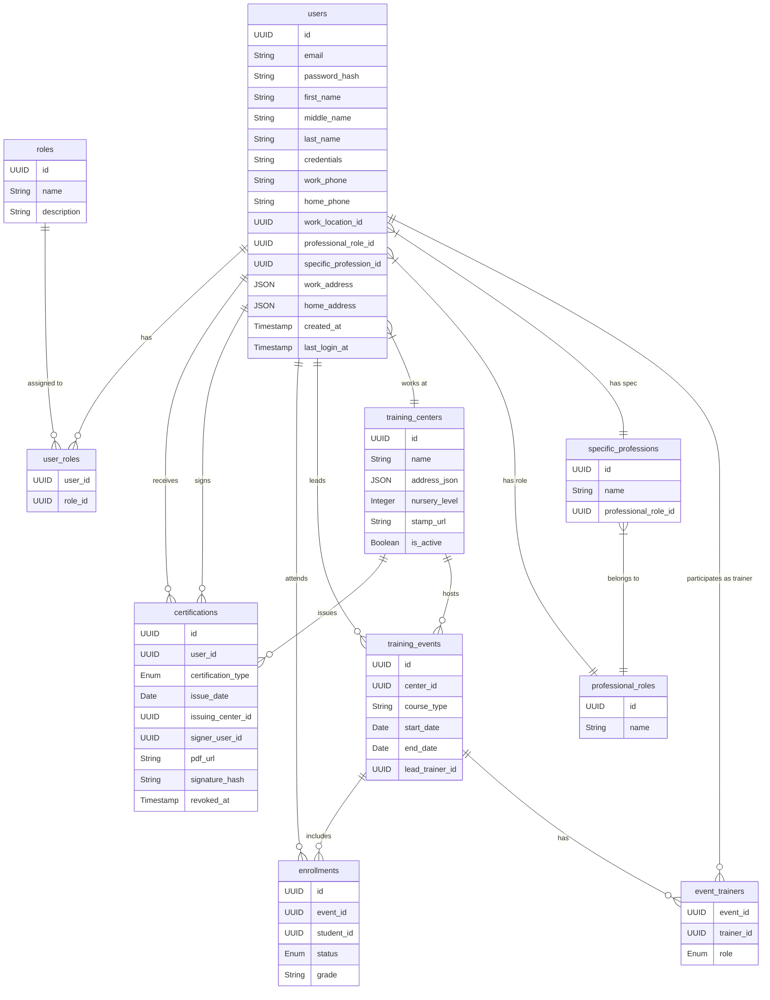

# Proposed Database Structure & Schema

## Overview
This schema is designed to support the **BigNap** modern web application. It transitions from the legacy "Student-centric" flat model to a robust relational model that supports sophisticated Role-Based Access Control (RBAC), digital certification, and event-based training management.

## 1. Authentication & RBAC System

We move away from the "Trainer" boolean flag to a flexible Role system. A user can hold multiple roles (e.g., a *Master Trainer* who is also a *Center Director*).

### `users`
 The core identity entity.
*   `id`: UUID (Primary Key)
*   `email`: String (Unique, Indexed)
*   `password_hash`: String (Argon2id)
*   `first_name`: String
*   `middle_name`: String
*   `last_name`: String
*   `credentials`: String (e.g., "PhD, RN")
*   `work_phone`: String
*   `home_phone`: String
*   `work_location_id`: UUID (FK -> training_centers.id)
*   `professional_role_id`: UUID (FK -> professional_roles.id)
*   `specific_profession_id`: UUID (FK -> specific_professions.id)
*   `work_address`: JSON (Structured: street, city, state, zip, country)
*   `home_address`: JSON (Structured: street, city, state, zip, country)
*   `created_at`: Timestamp
*   `last_login_at`: Timestamp

### `roles`
*   `id`: UUID (PK)
*   `name`: String (Unique Enum: `admin`, `master_trainer`, `trainer`, `student`, `center_director`)
*   `description`: String

### `user_roles`
Many-to-Many junction table.
*   `user_id`: UUID (FK -> users.id)
*   `role_id`: UUID (FK -> roles.id)

### `professional_roles`
*   `id`: UUID (PK)
*   `name`: String (e.g., Nurse, Physician, OT, PT)

### `specific_professions`
*   `id`: UUID (PK)
*   `name`: String
*   `professional_role_id`: UUID (FK -> professional_roles.id)

> **Permissions Logic:**
> *   **Admin:** Full system access.
> *   **Master Trainer:** Can certify Trainers and Students; can approve Center stamps.
> *   **Trainer:** Can certify Students; can create Training Events.
> *   **Student:** Can view own profile, certifications, and download PDFs.

---

## 2. Organization & Locations

### `training_centers` (Locations)
Represents physical hospitals or training sites.
*   `id`: UUID (PK)
*   `name`: String
*   `address_json`: JSON (Structured: street, city, state, zip, country)
*   `nursery_level`: Integer (I, II, III, IV)
*   `stamp_url`: String (URL to hosted PNG/SVG). **Critical for Certificates.**
*   `is_active`: Boolean

---

## 3. Training & Events

We separate the *Event* (the class) from the *Person* (the enrollment).

### `training_events`
A scheduled training session.
*   `id`: UUID (PK)
*   `center_id`: UUID (FK -> training_centers.id)
*   `course_type`: Enum (NIDCAP, APIB, FINE, etc.)
*   `start_date`: Date
*   `end_date`: Date
*   `lead_trainer_id`: UUID (FK -> users.id) - The primary instructor.

### `event_trainers`
Allows multiple trainers per event.
*   `event_id`: UUID (FK)
*   `trainer_id`: UUID (FK)
*   `role`: Enum (Lead, Support, Trainee-Trainer)

### `enrollments`
Links a student to an event.
*   `id`: UUID (PK)
*   `event_id`: UUID (FK)
*   `student_id`: UUID (FK)
*   `status`: Enum (Registered, Attended, Completed, Incomplete)
*   `grade`: String (Nullable)

---

## 4. Certification & Digital Signatures

This module handles the generation and verification of digital certificates.

### `certifications`
The official record of a qualification.
*   `id`: UUID (PK)
*   `user_id`: UUID (FK -> users.id) - The recipient.
*   `certification_type`: EnumLike (NIDCAP Professional, APIB Professional, etc.)
*   `issue_date`: Date
*   `issuing_center_id`: UUID (FK -> training_centers.id) - Determines which **Stamp** to use.
*   `signer_user_id`: UUID (FK -> users.id) - The Master Trainer/Trainer who signed off.
*   `pdf_url`: String (Path to the generated PDF in storage).
*   `signature_hash`: String (Cryptographic hash of the signed document for verification).
*   `revoked_at`: Timestamp (Nullable) - Allows invalidating certificates if necessary.

---

## ER Diagram

## Integration Points

1.  **Certificate Generation Service:**
    *   Triggered when a Trainer marks an Enrollment as `Completed` + `Certified`.
    *   **Input:** Student Name, Course Date, Center Stamp (fetched from `training_centers.stamp_url`), Trainer Signature (from `users.signature_url` or similar).
    *   **Process:** Generate PDF -> Sign with Server Key -> Upload to S3/Blob Storage -> Save URL to DB.

2.  **Stamp Management:**
    *   UI allows Center Directors or Admins to upload a transparent PNG/SVG.
    *   Backend validates dimensions/aspect ratio before saving to `training_centers`.
